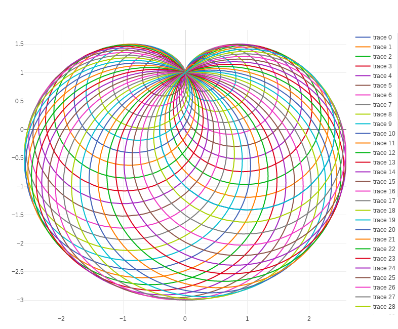

## My plots with Julia Lang

> Just for fun

### Requeriments

**Julia 1.1.0**

**package dependencies:**

- Blink
- PlotlyJS

### Installing dependencies

```
julia deps.jl
```

### Running

Open the Julia REPL:

```sh
julia> include("plots/cardioid.jl")
```

### Screenshots

<div align="center">




</div>

#

by <a href="https://github.com/jeovazero">@jeovazero</a>
